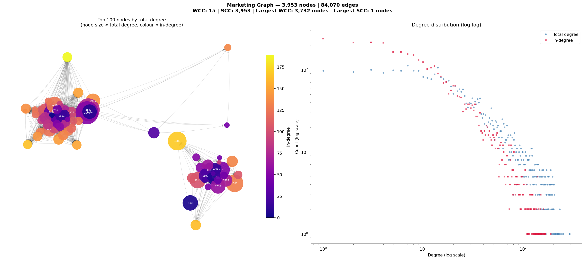

# Graph Analysis

## Basic Statistics

| Metric | Value |
|--------|-------|
| Nodes | 3,953 |
| Edges | 84,070 |
| Type | Undirected (SNAP Facebook) |
| Mean degree | ~42.5 |
| Median degree | ~25 |
| Min degree | 1 |
| Max degree | 293 |

## Connected Components

| Metric | Value |
|--------|-------|
| Total connected components | 15 |
| Largest component size | 3,732 nodes (94.4%) |
| 2nd largest component | 180 nodes |
| Graph diameter estimate | ~13 hops |

The graph has one dominant giant component containing nearly all nodes, which is typical for real social networks.

## Degree Distribution

The degree distribution follows a **heavy-tailed (scale-free-like) power law**, confirmed by log-log plot. This means:
- Most nodes have low degree (easy cascade targets, cheap to seed)
- A few hub nodes have very high degree (expensive to seed, but trigger wide spread)

## Top 20 Nodes by Degree

| Rank | Node | In-deg | Out-deg | Total |
|------|------|--------|---------|-------|
| 1 | 2543 | 51 | 242 | 293 |
| 2 | 2347 | 76 | 214 | 290 |
| 3 | 1888 | 168 | 85 | 253 |
| 4 | 1800 | 130 | 114 | 244 |
| 5 | 1663 | 102 | 132 | 234 |
| 6 | 1352 | 50 | 183 | 233 |
| 7 | 2266 | 125 | 108 | 233 |
| 8 | 483 | 4 | 224 | 228 |
| 9 | 1730 | 60 | 165 | 225 |
| 10 | 1985 | 140 | 83 | 223 |

> Note: in/out-degree here is an artifact of loading as directed. In the undirected graph used for simulation, only total degree matters.

## Top Node by Betweenness Centrality

| Node | Betweenness (approx) |
|------|---------------------|
| 1577 | 0.02667 |
| 606 | 0.01270 |
| 1077 | 0.01251 |
| 1863 | 0.01036 |
| 917 | 0.01035 |

Node **1577** is the single most important bridge/broker — it lies on ~2.7% of all shortest paths despite not being top-20 by degree.

## Visualization

Left panel: Top 100 nodes by degree (spring layout). Node size ∝ degree, color ∝ in-degree.
Right panel: Log-log degree distribution showing power-law tail.

## Key Structural Observations

1. **Scale-free structure:** Power-law degree distribution → viral cascades can reach exponentially many nodes once started in hubs
2. **Single giant component:** 94.4% of nodes are reachable from any other node → a well-placed seed can theoretically reach the whole network
3. **High average degree (42.5):** Threshold of 18% = need ~7.6 infected neighbors on average to trigger a new user; for low-degree nodes (degree 5) only 1 infected neighbor needed
4. **Separate small components:** 221 nodes in smaller components may require separate seeding strategies

## Threshold Analysis

For a node with degree $d$, it goes viral when $\lceil 0.18 \times d \rceil$ neighbors are infected:

| Node degree | Neighbors needed | 
|-------------|-----------------|
| 5 | 1 |
| 10 | 2 |
| 20 | 4 |
| 50 | 9 |
| 100 | 18 |
| 200 | 36 |

**Low-degree nodes are easiest to cascade into** — only 1-2 infected neighbors needed!

## Contract Cost vs. Cascade Potential

For a hub node with degree 293: **cost = 300 × 293 = 87,900 rubles** — impossible with initial budget of 10,000.

For a typical node with degree 10: **cost = 300 × 10 = 3,000 rubles** — affordable, seeds 3 per initial budget.

The sweet spot: nodes with moderate degree (15-30) that bridge dense clusters.
- Cost: 4,500–9,000 rubles each
- Can trigger cascades into their neighborhood
